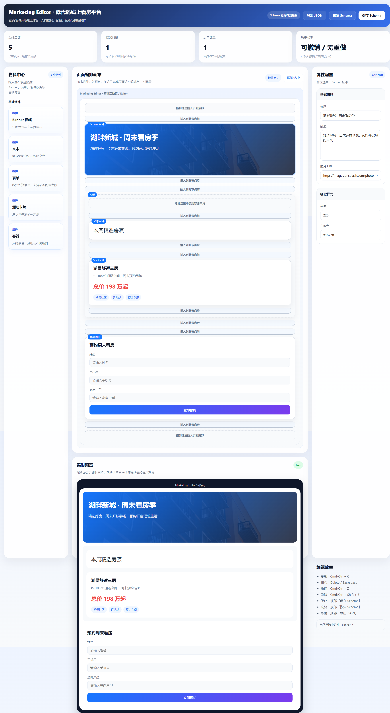
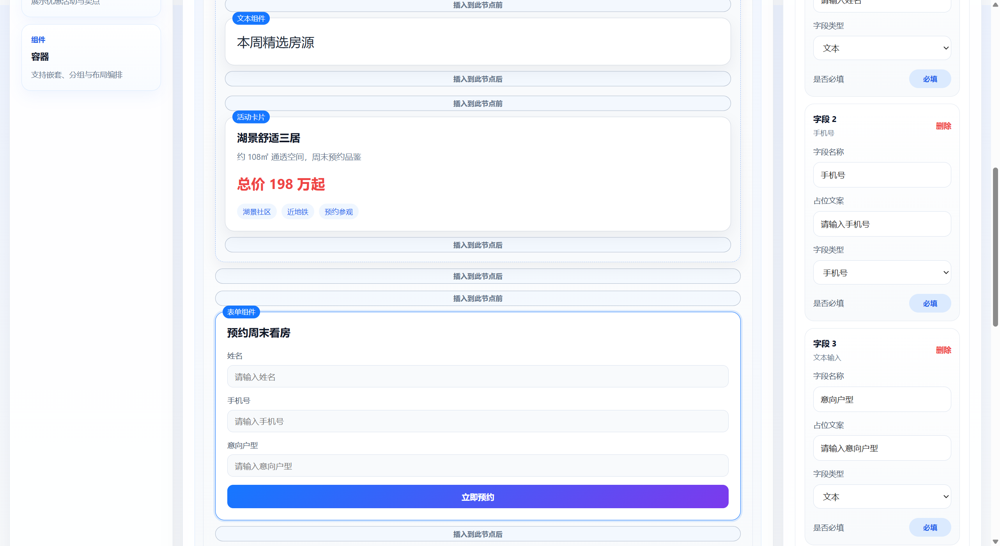
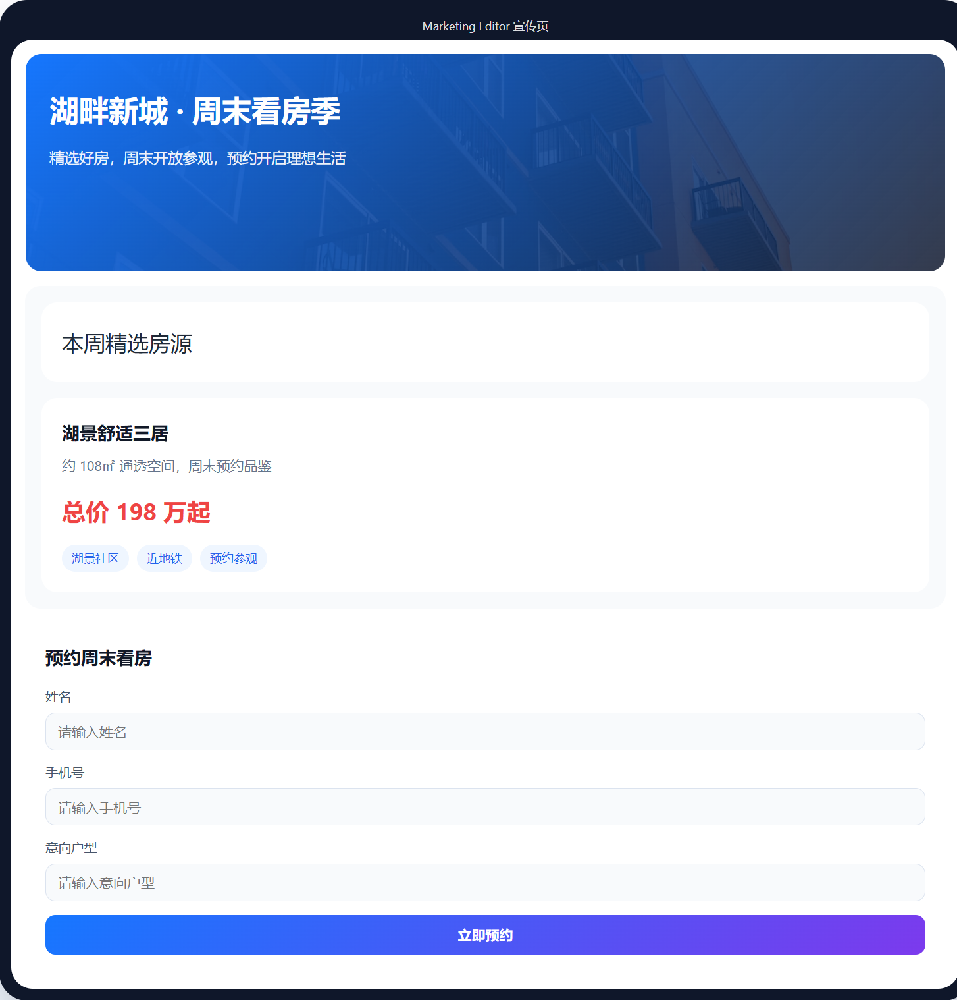
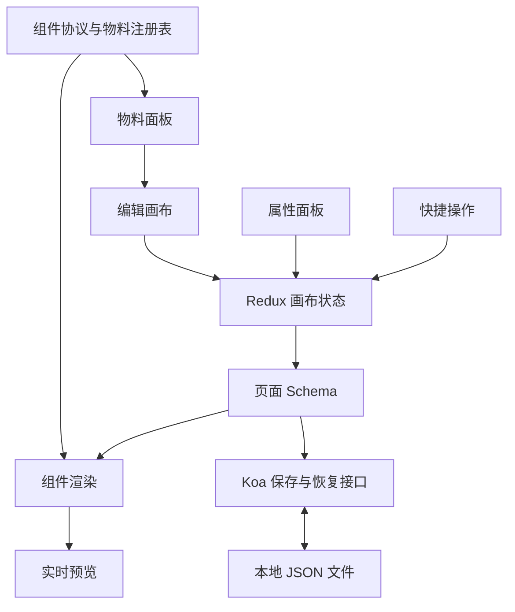

# Marketing Editor｜智能营销运营工作台

面向房产营销场景的低代码页面搭建平台。通过物料拖拽、属性配置和实时预览生成营销活动页，让运营人员自主调整页面内容，降低研发介入成本，提升营销物料生产效率。

前端使用 **React 18 + TypeScript** 构建物料面板、编辑画布、属性面板与预览界面，通过 **Redux Toolkit + dnd-kit + Hotkeys** 组织编辑状态与交互；后端使用 **Koa** 提供页面 Schema 的保存与恢复接口。

## 项目预览

### 编辑器全貌



顶部项目名称与快捷操作、左侧物料中心、中间拖拽画布与右侧属性配置同屏协作，选中 Banner 后即可直接编辑其文案与视觉样式。

### 表单配置



画布中的预约表单与右侧字段配置联动，姓名、手机号、意向户型等字段的字段名称、占位文案、字段类型与必填状态均可动态调整。

### 实时预览



编辑态与预览态共用同一份页面 Schema，配置变更即时同步为 Banner、房源卡片与预约表单的最终展示效果。

## 核心亮点

### Schema 驱动与组件协议

基于 **组件协议 + 页面 Schema** 组织动态渲染，将页面结构与组件实现分离。通过物料注册表描述组件类型、默认属性与配置方式，支持 Banner、文本、表单、活动卡片和容器等物料的标准化接入与跨页面复用。

相比固定模板，Schema 驱动方案将页面内容与层级关系转为结构化数据，便于拖拽编排、属性修改、预览和持久化共用同一份页面描述。

### Redux 画布状态管理

基于 **Redux Toolkit** 构建画布状态模型，组织组件树、选中状态、属性配置与页面 Schema 的数据流。物料面板、画布和属性面板围绕统一状态协作，支撑拖拽编排、节点选择与组件联动，减少多份页面数据分别维护带来的一致性问题。

### dnd-kit 拖拽与嵌套布局

基于 **dnd-kit** 的拖拽事件与碰撞检测组织拖拽生命周期，结合节点层级与插入位置描述移动意图。围绕新增、移动、排序和容器嵌套设计交互，让营销模块能够按页面内容自由组合。

### 历史记录与 Command Pattern 设计

支持撤销、重做与连续属性操作合并，减少高频编辑产生的历史噪声。针对全量页面快照的存储开销，**Command Pattern 设计方案**将新增、移动与属性修改抽象为可逆命令，通过执行与撤销逻辑组织操作记录。

当前仓库通过页面快照完成状态回滚，尚未采用可逆命令执行链路。

### 快捷操作与实时预览

- **快捷操作**：通过 **Hotkeys** 统一复制、删除、撤销与重做等高频交互入口。
- **属性配置**：按组件类型组织文案、样式与表单字段配置，选中节点后即可调整内容。
- **实时预览**：编辑态与预览态围绕同一份 Schema 同步，及时反馈页面配置结果。
- **保存与恢复**：通过 Koa 接口持久化页面 Schema，并支持导出 JSON。

## 技术栈与架构

| 层级 | 技术 |
| --- | --- |
| 前端 | React 18、TypeScript、Ant Design |
| 状态与交互 | Redux Toolkit、React Redux、dnd-kit、Hotkeys |
| 构建 | Webpack、Babel、pnpm |
| 后端 | Koa、koa-router、koa-body |
| 持久化 | 本地 JSON 文件 |
| 开发进程 | PM2 |



**使用流程**：选择物料 → 拖拽编排与容器嵌套 → 配置组件属性 → 查看实时预览 → 保存或导出页面 Schema。

常用快捷键：`Ctrl/Cmd + C` 复制、`Delete/Backspace` 删除、`Ctrl/Cmd + Z` 撤销、`Ctrl/Cmd + Shift + Z` 重做。

## 快速开始

### 环境要求

- Node.js 22（本地验证版本为 22.20.0）
- pnpm 10.20.0（已在 `packageManager` 中固定）
- PM2 随项目依赖安装，无需全局安装

### 获取项目与安装依赖（Windows PowerShell）

```powershell
git clone https://github.com/a446628089/marketing-editor.git
cd marketing-editor

pnpm install --frozen-lockfile
```

项目级 `.npmrc` 使用 npm 官方源，不修改本机全局配置。

内存不足时，可在 PowerShell 中降低安装并发后重试：

```powershell
$env:PNPM_MAX_WORKERS = "1"
pnpm install --frozen-lockfile --network-concurrency=4 --child-concurrency=1 --package-import-method=copy
```

### 本地启动

在仓库根目录执行：

```powershell
pnpm dev
```

PM2 会在后台启动前端 8080 与后端 8081，关闭终端不会自动停止服务。启动前应确保两个端口可用；结束开发时执行：

```powershell
pnpm stop
```

如需在当前终端运行前后端，可使用 `pnpm dev:all`；不要与后台模式同时占用相同端口。

### 访问地址

- 编辑器：[http://localhost:8080](http://localhost:8080)
- 服务检查：[http://localhost:8081/api](http://localhost:8081/api)
- Schema 接口：`GET /api/schema`、`POST /api/schema`

Webpack 开发服务将 `/api` 代理到 `http://localhost:8081`。

### 端口配置

开发进程配置位于 `ecosystem.config.js`。后端通过 `PORT` 指定监听端口，前端通过 `API_TARGET` 指定接口代理目标；调整后端端口时需同步修改代理目标。前端开发端口在 `package/client/build/webpack.dev.js` 中配置，默认值为 8080。

### 构建

```powershell
pnpm build:all
pnpm start
```

`build:all` 使用跨平台清理脚本，再依次构建前后端，产物位于 `output/`。`pnpm start` 在当前终端启动生产服务，通过 [http://localhost:8081](http://localhost:8081) 同时访问页面与接口，按 `Ctrl+C` 停止；启动前先停止开发服务，避免端口冲突。

构建包含前后端类型检查，也可用 `pnpm typecheck` 单独检查。Webpack 的资源体积警告不影响构建产物生成或服务启动。

## 项目结构

```text
.
├── package/
│   ├── client/
│   │   ├── components/   # 编辑器与预览界面
│   │   ├── pages/        # 页面入口
│   │   ├── schemas/      # 组件协议与物料注册
│   │   ├── store/        # 画布状态管理
│   │   ├── utils/        # 树结构与 ID 工具
│   │   └── build/        # Webpack 配置
│   └── server/           # Koa 接口与本地持久化
├── scripts/              # 开发辅助脚本
└── ecosystem.config.js   # PM2 开发进程配置
```

## 使用说明

### 保存、恢复与导出

- **保存 Schema**：将当前页面写入后端，覆盖上一次保存的内容。
- **恢复 Schema**：从后端重新加载最近保存的页面，替换当前编辑内容；尚未保存的修改请先保存或导出。
- **导出 JSON**：将当前页面 Schema 下载为本地文件，用于备份。恢复按钮读取后端保存的数据，不会读取下载的 JSON 文件。

### 数据保存位置

开发模式下页面保存到 `package/server/data/editor-schema.json`；生产模式保存到 `output/data/editor-schema.json`，两种模式的数据分别保存，均不提交到仓库。尚未保存页面时，Schema 接口返回 `schema: null`；保存接口会创建所需目录及文件。

**重新构建会清理 `output/`，包括生产模式保存的页面数据。** 构建前请先导出需要保留的页面 JSON。

## License

ISC
