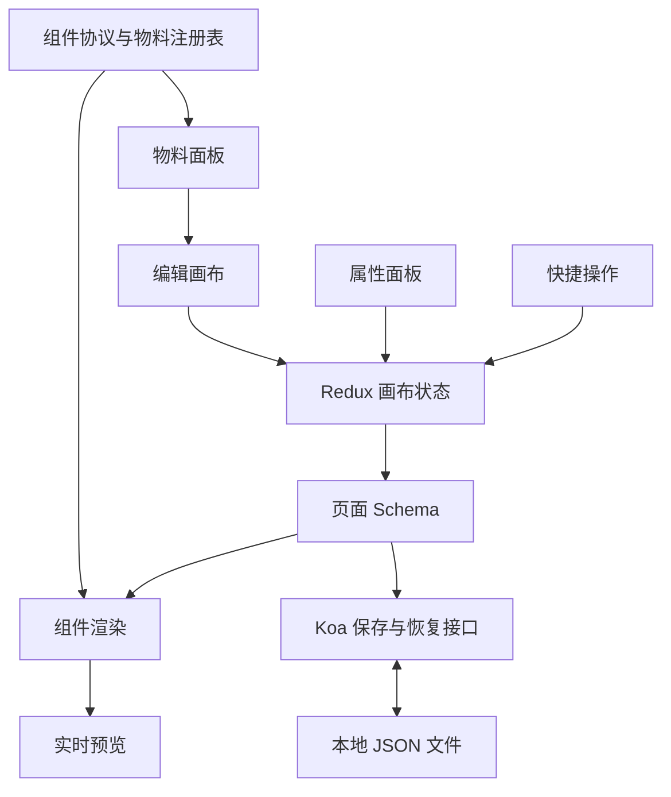

# Marketing Editor｜智能营销运营工作台

面向房产营销场景的低代码页面搭建平台。通过物料拖拽、属性配置和实时预览生成营销活动页，让运营人员自主调整页面内容，降低研发介入成本，提升营销物料生产效率。

前端使用 **React 18 + TypeScript** 构建物料面板、编辑画布、属性面板与预览界面，通过 **Redux Toolkit + dnd-kit + Hotkeys** 组织编辑状态与交互；后端使用 **Koa** 提供页面 Schema 的保存与恢复接口。

## 核心亮点

### Schema 驱动与组件协议

基于 **组件协议 + 页面 Schema** 组织动态渲染，将页面结构与组件实现分离。通过物料注册表描述组件类型、默认属性与配置方式，支持 Banner、文本、表单、活动卡片和容器等物料的标准化接入与跨页面复用。

相比固定模板，Schema 驱动方案将页面内容与层级关系转为结构化数据，便于拖拽编排、属性修改、预览和持久化共用同一份页面描述。

### Redux 画布状态管理

基于 **Redux Toolkit** 构建画布状态模型，组织组件树、选中状态、属性配置与页面 Schema 的数据流。物料面板、画布和属性面板围绕统一状态协作，支撑拖拽编排、节点选择与组件联动，减少多份页面数据分别维护带来的一致性问题。

### dnd-kit 拖拽与嵌套布局

基于 **dnd-kit** 的拖拽事件与碰撞检测组织拖拽生命周期，结合节点层级与插入位置描述移动意图。围绕新增、移动、排序和容器嵌套设计交互，让营销模块能够按页面内容自由组合。

### Command Pattern 历史管理方案

针对全量页面快照带来的存储开销，采用 **Command Pattern** 作为历史管理设计方案，将新增、移动与属性修改抽象为可逆命令，通过执行与撤销逻辑组织操作记录。结合连续操作合并，减少高频编辑产生的历史噪声，为撤销、重做和状态回滚提供设计基础。

### 快捷操作与实时预览

- **快捷操作**：通过 **Hotkeys** 统一复制、删除、撤销与重做等高频交互入口。
- **属性配置**：按组件类型组织文案、样式与表单字段配置，选中节点后即可调整内容。
- **实时预览**：编辑态与预览态围绕同一份 Schema 同步，及时反馈页面配置结果。
- **保存与恢复**：通过 Koa 接口持久化页面 Schema，并支持导出 JSON。

## 技术栈与架构

| 层级 | 技术 |
| --- | --- |
| 前端 | React 18、TypeScript、Ant Design |
| 状态与交互 | Redux Toolkit、React Redux、dnd-kit、Hotkeys |
| 构建 | Webpack、Babel、pnpm |
| 后端 | Koa、koa-router、koa-body |
| 持久化 | 本地 JSON 文件 |
| 开发进程 | PM2 |



**使用流程**：选择物料 → 拖拽编排与容器嵌套 → 配置组件属性 → 查看实时预览 → 保存或导出页面 Schema。

常用快捷键：`Ctrl/Cmd + C` 复制、`Delete/Backspace` 删除、`Ctrl/Cmd + Z` 撤销、`Ctrl/Cmd + Shift + Z` 重做。

## 快速开始

### 环境要求

- Node.js 22（本地验证版本为 22.20.0）
- pnpm（用于按锁文件安装依赖）
- PM2（用于管理前后端开发进程）

### 获取项目与安装依赖（Windows PowerShell）

```powershell
git clone https://github.com/a446628089/marketing-editor.git
cd marketing-editor

pnpm install --frozen-lockfile
npm install -g pm2
```

仓库当前为私有，克隆时需要具有访问权限的 GitHub 账号。已安装 PM2 时可跳过全局安装步骤。

### 本地启动

在仓库根目录执行：

```powershell
npm run dev
```

PM2 会在后台启动前端 8080 与后端 8081，关闭终端不会自动停止服务。启动前应确保两个端口可用；结束开发时执行：

```powershell
npm run stop
```

### 访问地址

- 编辑器：[http://localhost:8080](http://localhost:8080)
- 服务检查：[http://localhost:8081/api](http://localhost:8081/api)
- Schema 接口：`GET /api/schema`、`POST /api/schema`

Webpack 开发服务将 `/api` 代理到 `http://localhost:8081`。

### 构建

```powershell
npm run build:client
npm run build:server
```

构建产物位于 `output/`。Windows 下分别执行前后端构建，避免依赖 `build:all` 中的 Unix 清理命令；当前后端构建限制见“当前边界”。

## 配置说明

开发进程配置位于 `ecosystem.config.js`。后端通过 `PORT` 指定监听端口，前端通过 `API_TARGET` 指定接口代理目标；调整后端端口时需同步修改代理目标。前端开发端口在 `package/client/build/webpack.dev.js` 中配置，默认值为 8080。

页面保存后写入 `package/server/data/editor-schema.json`，该文件属于本地运行数据，不提交到仓库。尚未保存页面时，Schema 接口返回 `schema: null`；保存接口会创建所需目录及文件。

## 项目结构

```text
.
├── package/
│   ├── client/
│   │   ├── components/   # 编辑器与预览界面
│   │   ├── pages/        # 页面入口
│   │   ├── schemas/      # 组件协议与物料注册
│   │   ├── store/        # 画布状态管理
│   │   ├── utils/        # 树结构与 ID 工具
│   │   └── build/        # Webpack 配置
│   └── server/           # Koa 接口与本地持久化
├── scripts/              # 开发辅助脚本
└── ecosystem.config.js   # PM2 开发进程配置
```

## 当前边界

以下为 2026-09-19 在 Windows、Node.js 22.20.0 下的验证结果；构建与启动使用本机原有依赖，未进行完整交互回归。

- 前端构建通过，Webpack 提示入口与资源体积超过建议值。
- 后端构建未通过：TypeScript 4.9.5 与 `@types/node` 25.6.0 的声明不兼容，出现 `Disposable`、`Symbol.dispose` 等类型错误。
- 独立目录的全新安装未完成：锁文件中的 `registry.npmmirror.com` 下载出现连接错误。
- 开发启动检查通过：编辑器页面、后端 `/api`、`/api/schema` 及前端 `/api` 代理均返回 HTTP 200。
- 本机 pnpm 11 对旧依赖目录触发重装确认，因此启动和构建通过 `npm run` 执行现有脚本。
- Command Pattern 部分介绍历史管理设计方案，本轮未对其实现完整性进行核验。

## License

ISC
